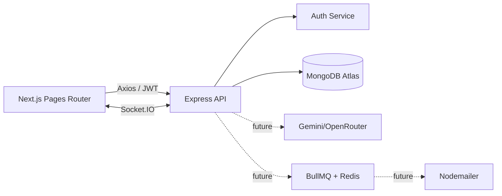

# EduFix

College Complaint Management System for transparent campus issue tracking.

## Current Status

Phases 1-5 are implemented as a deployable foundation: secure authentication, MongoDB persistence, complaint creation and history, lifecycle transitions, comments, feedback, department/admin APIs, AI rule-based fallback classification, Socket.IO server foundation, optional SMTP notifications, and SLA escalation fallback.

Cloudinary media processing, Redis-backed BullMQ workers, and external Gemini/OpenRouter calls remain optional integration points controlled by environment variables.

## Architecture



## Feature Showcase

- Domain-restricted student registration and bcrypt password hashing with cost factor 12.
- JWT access tokens with persistent Zustand client state.
- Protected `/api/auth/me` endpoint and reusable role authorization middleware.
- Helmet, CORS, Morgan, express-validator, and auth-specific rate limiting.
- Responsive landing page, login, registration, and student dashboard shell.
- MongoDB Atlas connection through `MONGODB_URI`, with a clear local no-database fallback.
- Socket.IO connection foundation ready for complaint rooms and lifecycle events.

## Project Structure

```text
client/                 Next.js Pages Router frontend
  src/pages/             landing, auth, dashboard, future feature routes
  src/store/             Zustand session state
  src/services/          Axios API client
server/                 Express backend
  src/config/            environment and database setup
  src/controllers/       thin HTTP handlers
  src/middleware/        JWT and request validation
  src/models/            Mongoose models
  src/routes/            API route declarations
  src/services/          business logic
  src/queues/            future BullMQ workers
spec.md                 product specification
```

## Local Setup

Requirements: Node.js 20+, npm, and a MongoDB Atlas database.

1. Install all dependencies:

   ```bash
   npm run install:all
   ```

2. Create local environment files:

   ```bash
   copy server/.env.example server/.env
   copy client/.env.example client/.env.local
   ```

3. Set `MONGODB_URI` and a new long random `JWT_SECRET` in `server/.env`. Never commit `.env` files. The MongoDB credential previously shared during setup should be rotated before use.

4. Start both applications:

   ```bash
   npm run dev
   ```

   Frontend: http://localhost:3000
   API: http://localhost:5000
   Health check: http://localhost:5000/api/health

There is no seed script in Phase 1 because only users exist so far. Department and complaint seed data will be added with their respective models.

## Environment Variables

### `server/.env`

| Variable | Purpose |
| --- | --- |
| `NODE_ENV` | Runtime mode |
| `PORT` | API port, defaults to `5000` |
| `CLIENT_URL` | Allowed frontend origin |
| `MONGODB_URI` | Permanent MongoDB Atlas connection string |
| `JWT_SECRET` | Signing secret; use a long random value |
| `JWT_EXPIRES_IN` | Token lifetime, defaults to `7d` |
| `COLLEGE_EMAIL_DOMAIN` | Allowed student email domain |

### `client/.env.local`

| Variable | Purpose |
| --- | --- |
| `NEXT_PUBLIC_API_URL` | Express API base URL |
| `NEXT_PUBLIC_SOCKET_URL` | Socket.IO server URL |

## API Endpoints

| Method | Endpoint | Phase 1 behavior |
| --- | --- | --- |
| GET | `/api/health` | Service health |
| POST | `/api/auth/register` | Register a domain-approved student |
| POST | `/api/auth/login` | Authenticate and issue JWT |
| GET | `/api/auth/me` | Return the authenticated profile |
| POST | `/api/complaints` | Planned Phase 2 |
| GET | `/api/complaints` | Planned Phase 2 |
| PUT | `/api/complaints/:id/status` | Planned Phase 3 |
| POST | `/api/complaints/:id/comments` | Planned Phase 3 |
| GET | `/api/admin/stats` | Planned Phase 6 |

## Development Phases

1. Setup and authentication: complete.
2. Complaints API, attachments, and student complaint history.
3. Lifecycle workflow, departments, assignments, comments, and staff tools.
4. Socket.IO events, email notifications, and background workers.
5. AI categorization, duplicate detection, SLA tracking, and escalation.
6. Admin analytics, ratings, testing, and deployment polish.

## Deployment Instructions & Links

- Database: create a MongoDB Atlas cluster, configure a least-privilege database user, allow the backend network, and set `MONGODB_URI` in the backend host.
- Backend: deploy `server/` to Render or Railway with `npm install` as the install command and `npm start` as the start command. Set `CLIENT_URL`, `JWT_SECRET`, and MongoDB variables.
- Frontend: deploy `client/` to Vercel with `npm run build` and `npm start` handled by the platform. Set `NEXT_PUBLIC_API_URL` and `NEXT_PUBLIC_SOCKET_URL` to the deployed backend.
- Redis: add a managed Redis connection before enabling BullMQ workers in Phase 4.

| Link | Value |
| --- | --- |
| GitHub Repository URL | [INSERT_YOUR_GITHUB_REPO_LINK] |
| Live Deployed Frontend URL | [INSERT_YOUR_LIVE_FRONTEND_URL] |
| Live Deployed Backend API URL | [INSERT_YOUR_LIVE_BACKEND_URL] |
